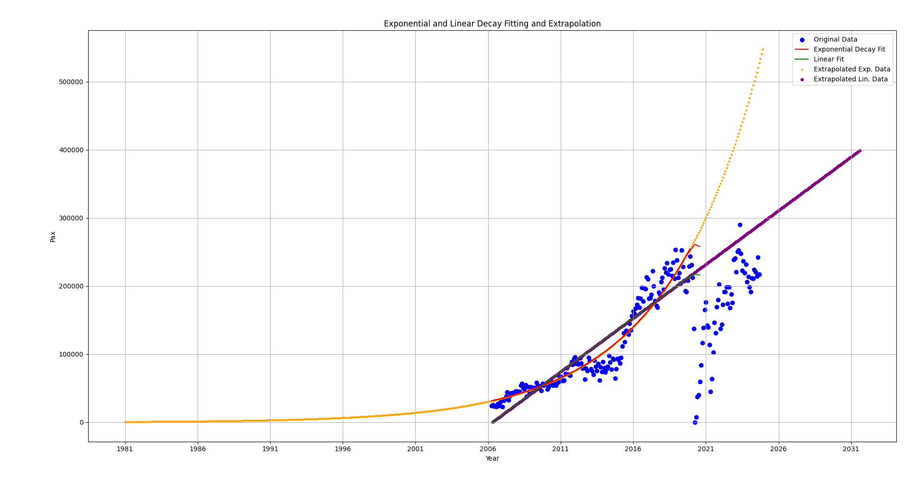
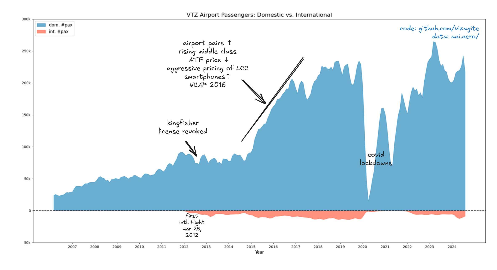

# vtz
VTZ airport traffic analysis

### Objective

- I had a simple question that made me do this: how long can new Alluri Sitaramaraju International Airport handle VTZ air traffic after phase-1 opens under observed growth rates?

Well, my guess after dabbling with data is we will hit 5 lakh monthly passenger mark of combined domestic and international pax on "Jan 2036", reaching the proposed phase-1 annual pax capabilites. Although the airport will supposedly start operating on 44 lakh pax per annum.

### Procedure

- Getting the annexure-3 data of public air traffic from aai. automate.
- Automate building csv of visakhapatnam data from pdfs. Recent IBM's docling seemed overkill, pymupdf worked fine
- Verify the data discrepancies
- Plot a streamgraph with matplotlib
- try to find the reasoning on previous dips and growths
- fit a curve onto data, linear regression as safe answer. Although, exponential has least MSE, a glance will show how such growth is completely limited just as a growth of bacteria is limited. 
We could also be ending up on some logistic regression but the optimistic view of upcoming employability, shopping malls and tourism focus could stimulate atleast a linear traffic growth.
- Anyway, let's wait and see in five years.

### Todo

- build a possible network of airport pairs for VTZ besties identification. find a historical search api. [update: data collected]

#### Support

If you love the design and want to support me, you can buy me a book :)

  

